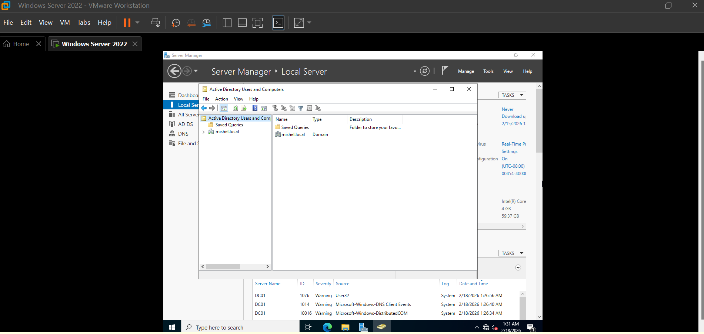
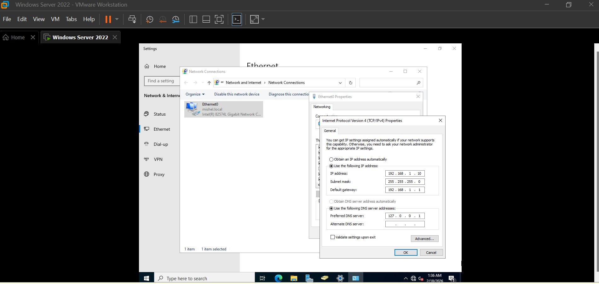

# Domain Controller Setup – Windows Server 2022

This section documents the process of setting up my first Domain Controller inside a virtual lab environment.

Instead of only following theory, I wanted to actually build the environment myself, learn from mistakes, and understand how Active Directory works behind the scenes.

---

## 💻 Environment

- Windows Server 2022 (Desktop Experience)
- VMware Workstation
- Active Directory Domain Services (AD DS)
- Domain: mishel.local
- Server Name: DC01

---

## 🧩 Server Manager After Promotion

After installing AD DS and promoting the server, the environment was successfully configured as a Domain Controller.

---

## 🏢 Active Directory Running

Once the domain was created, Active Directory Users and Computers confirmed that the domain structure was active and accessible.

---

## 🔐 Domain Login

After promotion, the system login changed to domain-based authentication, showing the domain context.

---

## 🌐 Static IP Configuration

Before promoting the server, I configured a static IP address to ensure DNS and domain services would function correctly.

---

## 🔧 Real Issues I Faced (Human Error Included)

This setup wasn’t perfect — and that’s honestly where most of the learning happened.

Some challenges included:

- Incorrect IP range configured due to human error, causing a gateway warning
- Boot issues during the first installation attempt
- DNS delegation warning during domain promotion

Instead of restarting from scratch, I worked through each issue step by step and learned how small configuration details can impact the entire environment.

---

## 🧠 What I Learned

Setting up a Domain Controller helped me understand:

- Why static IP and DNS must be configured correctly before installing AD DS
- How identity infrastructure is built from scratch
- That troubleshooting — including human mistakes — is a normal part of IT work

This setup became the foundation for everything else I will continue building in this lab.

