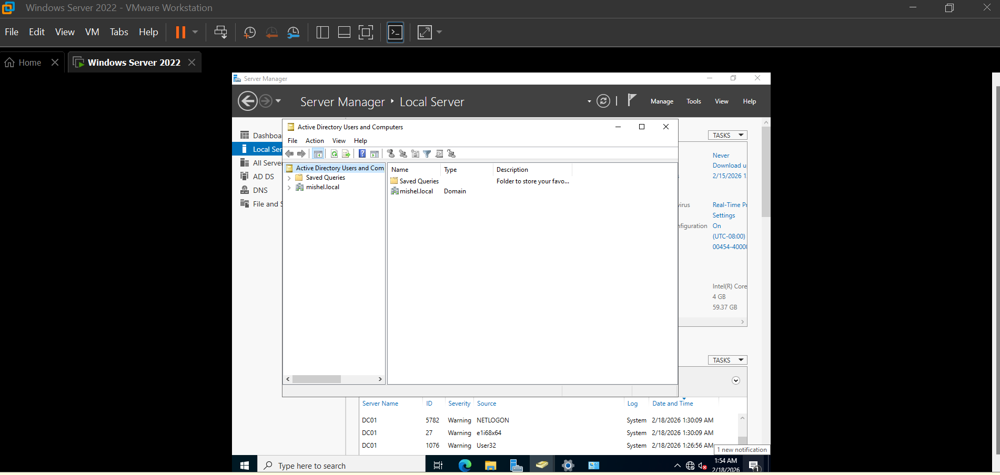
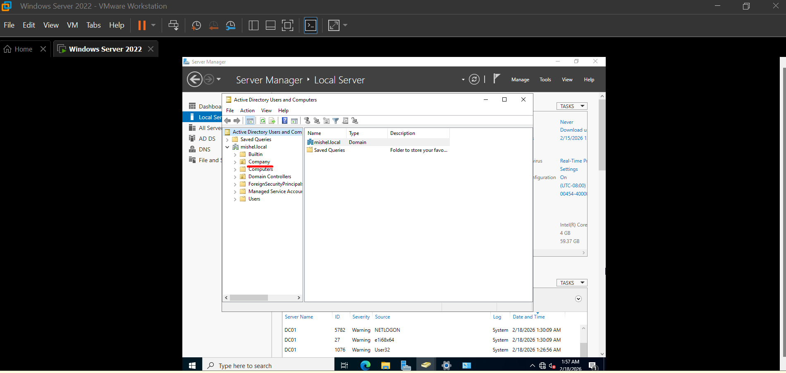

# Active Directory Design – Organizational Structure

After promoting my server to a Domain Controller, the next step was organizing the environment in a more realistic way using Organizational Units (OUs).

Instead of leaving everything under default containers, I created a basic structure to simulate how a small company might organize departments and resources inside Active Directory.

This helped me understand that setting up the infrastructure is only the first step — designing it properly makes administration much easier later.

---

## 🎯 Objective

The goal of this stage was to build a simple but structured layout that reflects a real IT environment.

By organizing users and departments into OUs, future tasks like permissions, group policies, and troubleshooting become easier to manage.

---

## 🖥️ Opening Active Directory Console

I started by accessing **Active Directory Users and Computers** from Server Manager.

---

## 🏢 Creating the Main Organizational Unit

The first OU created was **Company**, which acts as the root container for all departments.

---

## 🧩 Designing Department Structure

Inside the Company OU, I created department-based Organizational Units:

- IT
- HR
- Finance
- Sales
- Workstations

This structure simulates a small business environment and prepares the domain for future administrative tasks.

---

## ⚙️ Reviewing OU Properties

To better understand how OUs work, I explored the properties of one department (IT).  
This step helped me learn how descriptions and management settings can be configured later.

---

## 🌐 Domain Overview

After creating the structure, I reviewed the domain layout to confirm that everything was organized correctly.

---

## 🧠 What I Learned

Designing an Active Directory structure showed me that organization is just as important as technical setup.

Some key takeaways:

- Avoid relying only on default containers
- Create logical departmental separation
- Think ahead about policies and permissions
- Keep the structure simple but scalable

This stage made the environment feel much closer to a real enterprise setup rather than just a basic lab.

