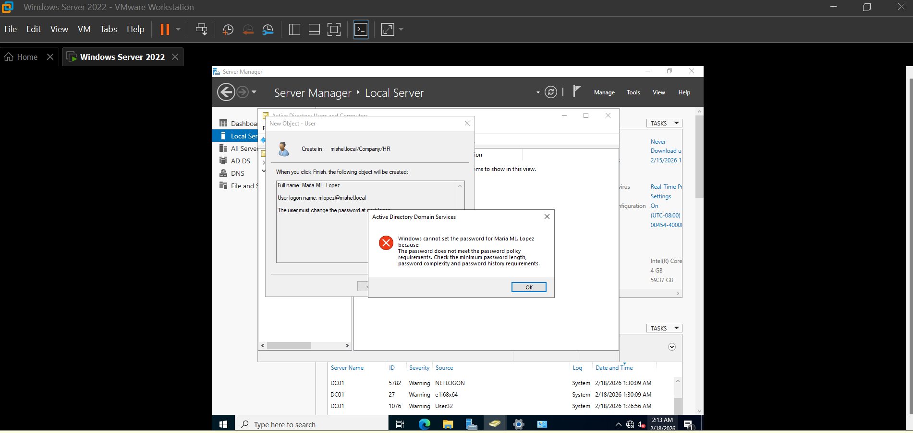
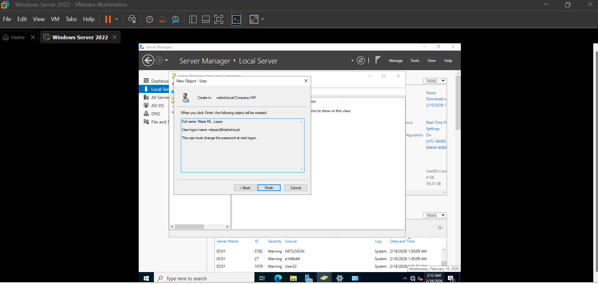

# 👤 Active Directory Lab 03 — Create Users

This section documents the process of creating and managing users inside Active Directory as part of my IT Support portfolio lab.

The objective was to simulate a real corporate environment by creating organizational units and managing user accounts.

---

## 🧰 Tools Used

- Windows Server 2022
- Active Directory Domain Services
- Active Directory Users and Computers (ADUC)
- Windows 11 Client VM
- VMware Workstation

---

## 📂 Opening Active Directory Users and Computers

First, I accessed **Active Directory Users and Computers** to begin user administration.

---

## 👤 Creating Users inside HR Organizational Unit

Users were created under the HR department to simulate a real organizational structure.

Example user created:

- Maria ML Lopez
- Username: mlopez

---

## ⚠️ Human Error — Password Policy Issue

During user creation, I encountered a password complexity error because the password did not meet domain policy requirements.

This reflects a common real-world scenario where admins must follow password standards.

---

## 🔐 Password Reset and Account Configuration

After correcting the password policy issue, the account was successfully configured and enabled.

---

## 🧪 Validation

After creating the user:

- Verified the account inside ADUC
- Confirmed OU placement
- Confirmed user properties

---

## 🎯 Skills Demonstrated

- Active Directory user administration
- OU structure management
- Password policy troubleshooting
- Account lifecycle management

---

## 💬 Notes

This lab simulates real IT Support tasks such as:

- Creating new hires
- Handling password policy errors
- Managing department-based users

All actions were performed inside a controlled virtual lab environment.

