# Lab 03 — Active Directory User Administration

This lab documents a complete IT Support workflow performed in a Windows Server 2022 Active Directory environment.  
The objective was to simulate real-world helpdesk tasks including user creation, password policy handling, domain joining, troubleshooting, and final login validation.

Environment:

- Windows Server 2022 — Domain Controller
- Windows 11 Client VM
- VMware Workstation
- Domain: mishel.local

---

## 1️⃣ Active Directory Setup & User Creation

Active Directory Users and Computers (ADUC) was used to create organizational units and manage user accounts.

Organizational Units created:

- HR Department
- Sales Department

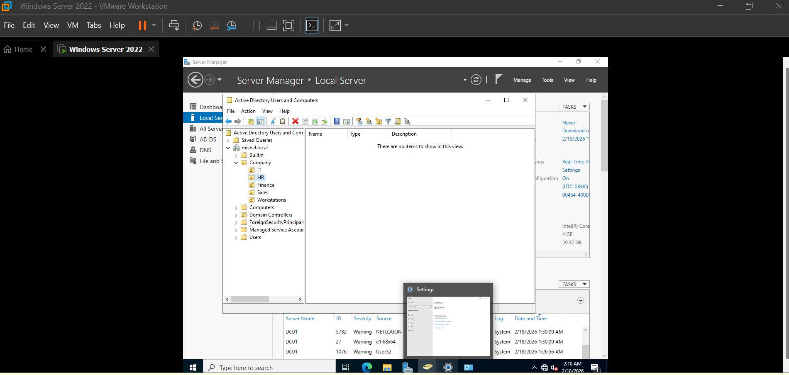

User accounts were created following basic organizational structure.

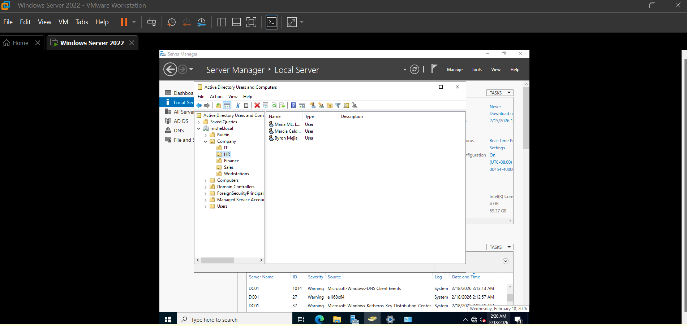

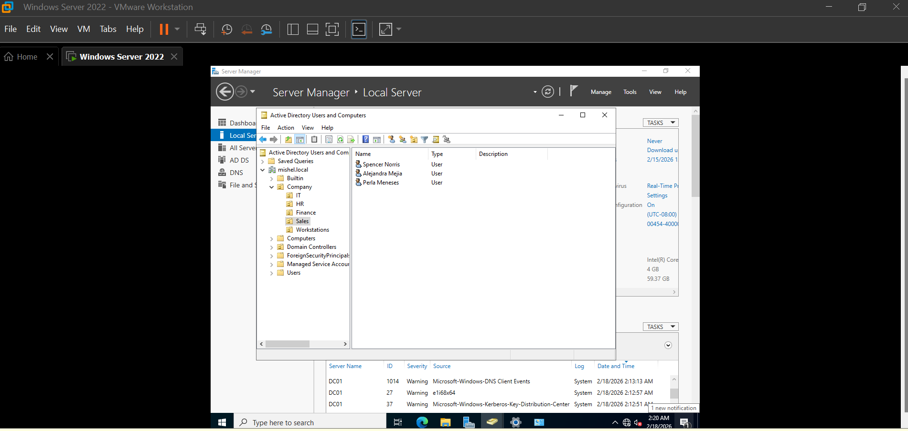

Example of HR user creation:

---

## 2️⃣ Password Policy — User Creation Scenario

While creating a new user account, a password complexity error occurred because the password did not meet the domain password policy requirements.

This represents a common IT Support scenario where administrators must comply with security standards during account provisioning.

Resolution:

- Reviewed password complexity rules
- Updated password using uppercase, lowercase, numbers, and symbols
- Successfully completed user creation

After provisioning, password management tasks such as resets were performed through Active Directory Users and Computers.

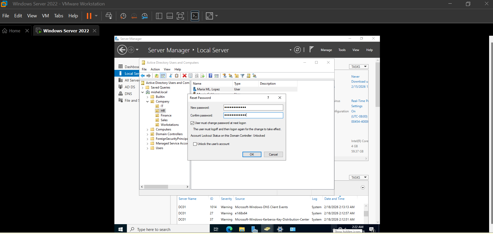

---

## 3️⃣ Windows 11 Client Configuration

The Windows 11 client virtual machine was prepared to connect to the domain.

Work or school account setup during configuration:

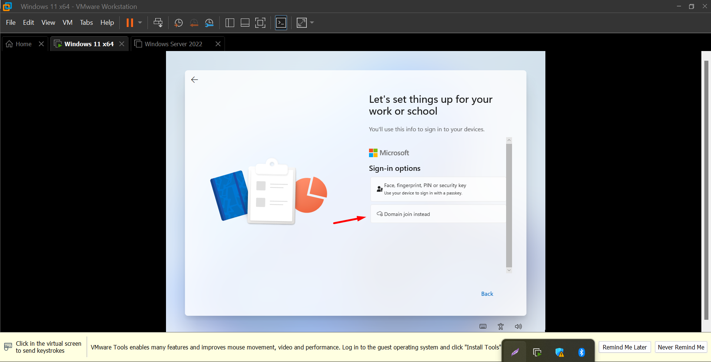

DNS settings were configured to point to the Domain Controller to allow domain discovery.

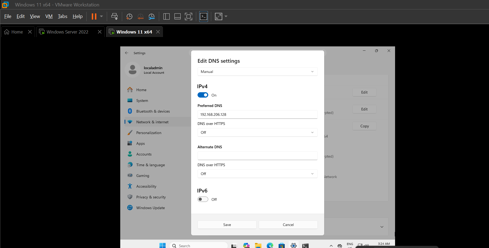

---

## 4️⃣ Domain Join Process

The client machine was joined to the Active Directory domain.

System before domain join:

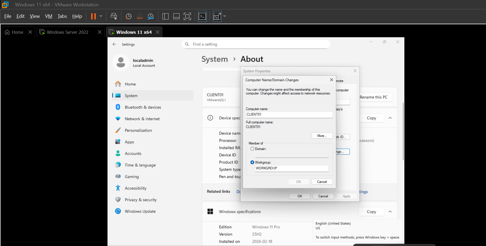

Domain join configuration window:

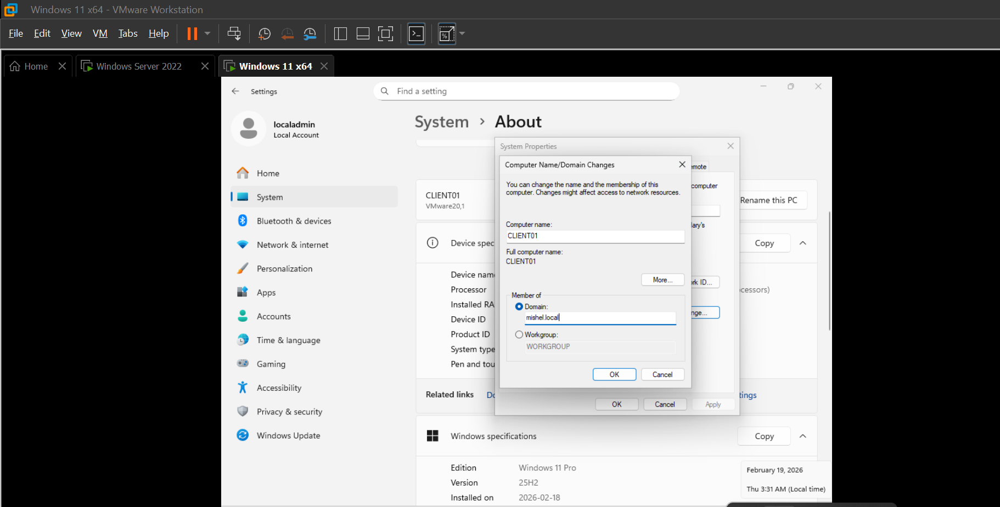

Successful domain join confirmation:

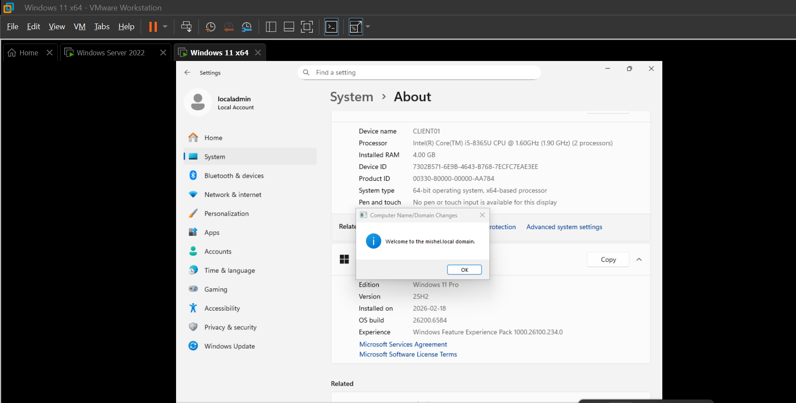

---

## 5️⃣ Troubleshooting — Connectivity Issue

A ping test initially failed, demonstrating a typical troubleshooting scenario handled by IT Support teams.
Root cause identified:

- DNS configuration mismatch between client and Domain Controller

Resolution steps:

- Verified DNS server IP address
- Confirmed VM network adapter settings
- Validated connectivity after correction

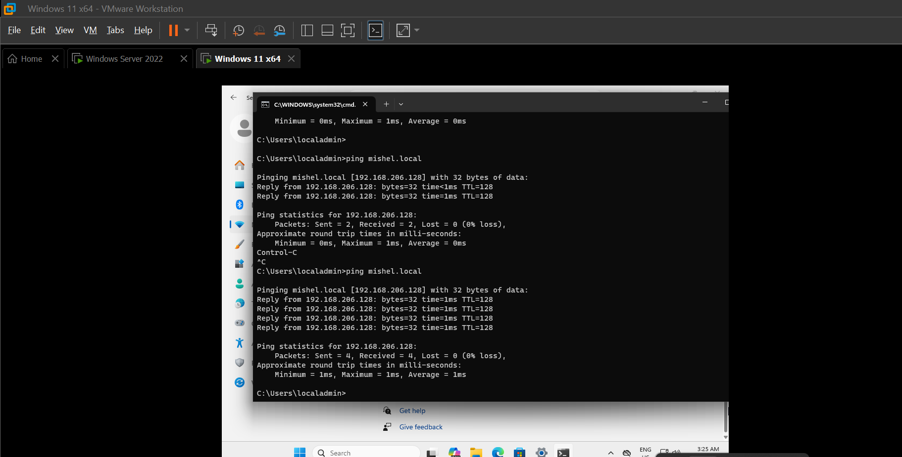

---

## ⭐ 6️⃣ Final Validation — Domain User Login

After completing setup and troubleshooting, domain login was validated successfully.

Login using domain user:

User session confirmation:

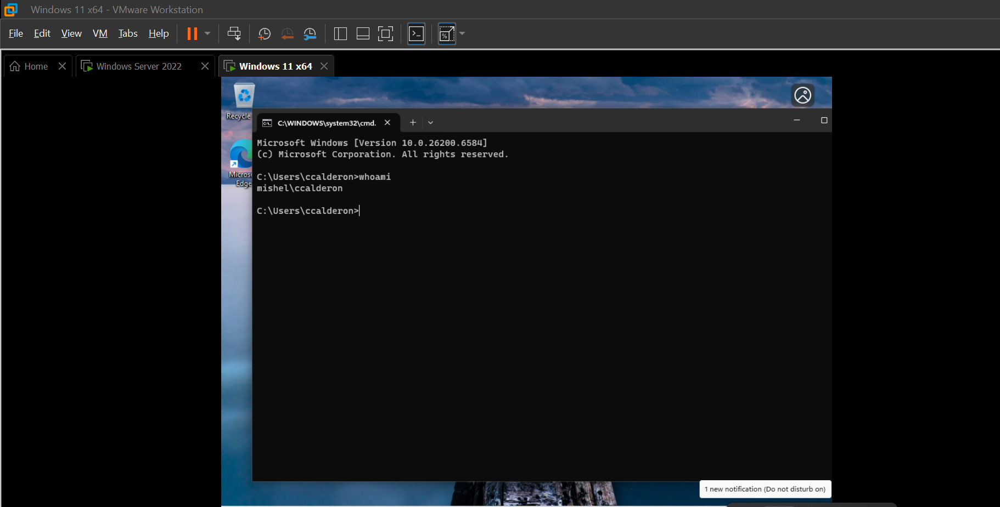

---

## 💡 Skills Demonstrated

- Active Directory user provisioning
- Organizational unit management
- Password policy handling
- Domain join configuration
- DNS troubleshooting
- Authentication validation
- Helpdesk-style issue resolution

---

## 📌 Notes

This lab reflects a realistic IT Support workflow from account creation to successful domain login validation, including password policy enforcement and troubleshooting scenarios.

