# Active Directory Lab — Groups and Permissions

## Objective

This lab simulates a structured enterprise environment where access to shared resources is controlled using Active Directory Security Groups, NTFS Permissions, SMB Shared Folders, and Role-Based Access Control (RBAC).

The main goal was to implement controlled access for different departments (HR and Sales) and validate permissions from a domain-joined client machine while applying real-world troubleshooting practices.

---

# Lab Architecture

Environment:

- Domain Controller: DC01
- Client Machine: CLIENT01
- Domain: mishel.local

Departments simulated:

- HR
- Sales
- Public Access

---

# Step 1 — Create Security Groups

Security groups were created inside Active Directory Users and Computers to centralize permission management and avoid assigning permissions directly to individual users.

Groups created:

- GG_HR_RW
- GG_SALES_RW
- GG_ALL_R

## Evidence

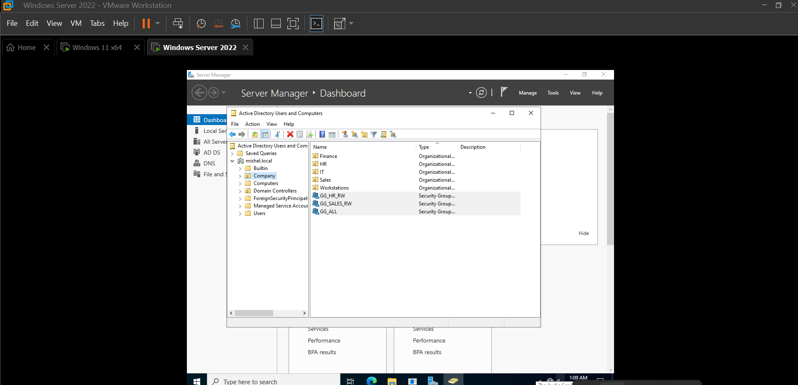

---

# Step 2 — Assign Users to Groups

Users were assigned to department groups to simulate enterprise access control. Managing access through groups improves scalability and reduces administrative effort.

## Evidence

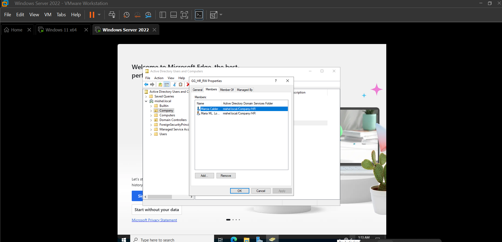

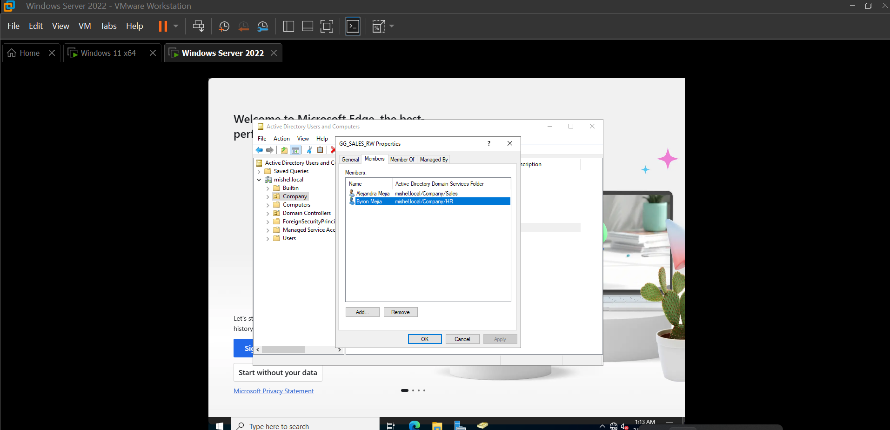

---

# Step 3 — Folder Structure

Folders were created on the domain controller to represent departmental file shares.

C:\Shares  
C:\Shares\HR  
C:\Shares\Sales  
C:\Shares\Public  

## Evidence

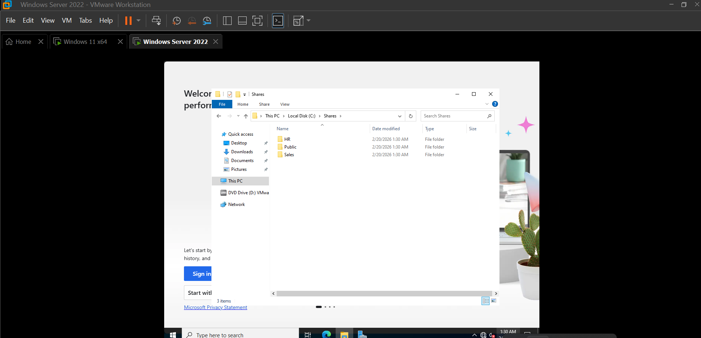

---

# Step 4 — Configure NTFS Permissions

NTFS permissions were applied using security groups instead of individual users.

HR Folder

- GG_HR_RW → Modify
- GG_ALL_R → Read & Execute

Sales Folder

- GG_SALES_RW → Modify
- GG_ALL_R → Read & Execute

Public Folder

- GG_ALL_R → Read & Execute

## Evidence

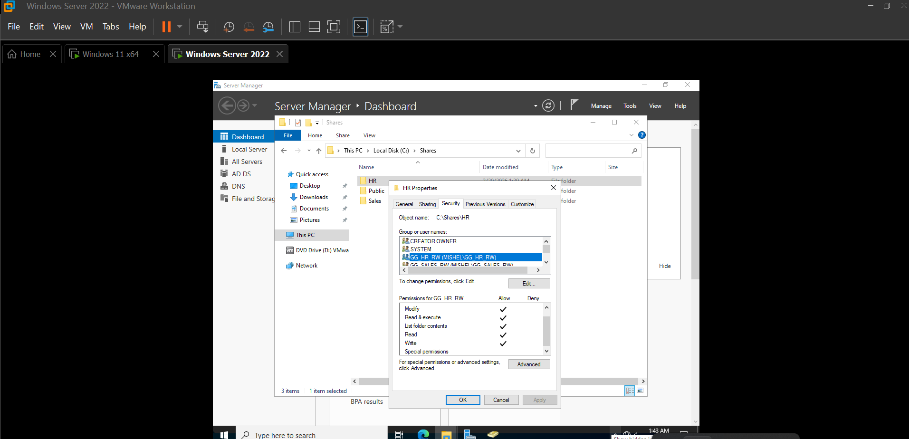
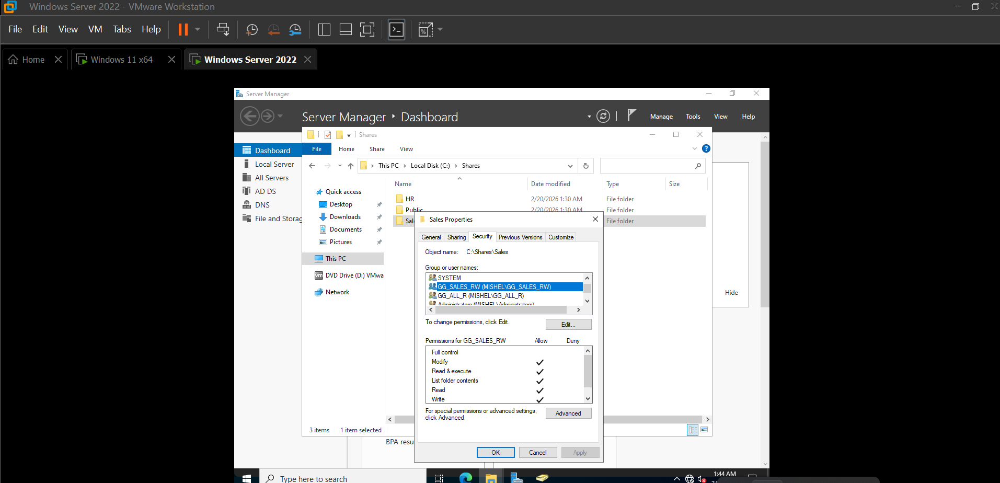

---

# Permission Design — AGDLP Model

Permissions were structured following enterprise design principles inspired by the AGDLP model:

Accounts → Global Groups → Permissions

Users are assigned to Global Groups, and those groups receive NTFS permissions. This approach reflects real-world access control where identity and resource permissions are separated.

Global Groups represent user identity:

- GG_HR_RW
- GG_SALES_RW
- GG_ALL_R

---

# NTFS Hardening and Inheritance Review

During configuration, inherited permissions from the parent folder were reviewed.

Default entries such as Users or Authenticated Users can unintentionally allow write access. Inheritance was analyzed and adjusted to enforce least privilege.

## Evidence

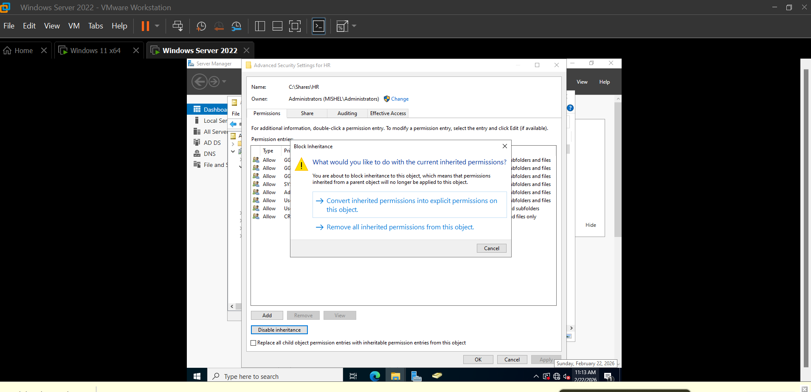

---

# Step 5 — Configure Shared Folders

Each department folder was shared using SMB.

Share names:

- \\DC01\HR
- \\DC01\Sales
- \\DC01\Public

Share permissions were configured broadly to allow network access, while NTFS permissions enforced the real security boundaries.

## Evidence

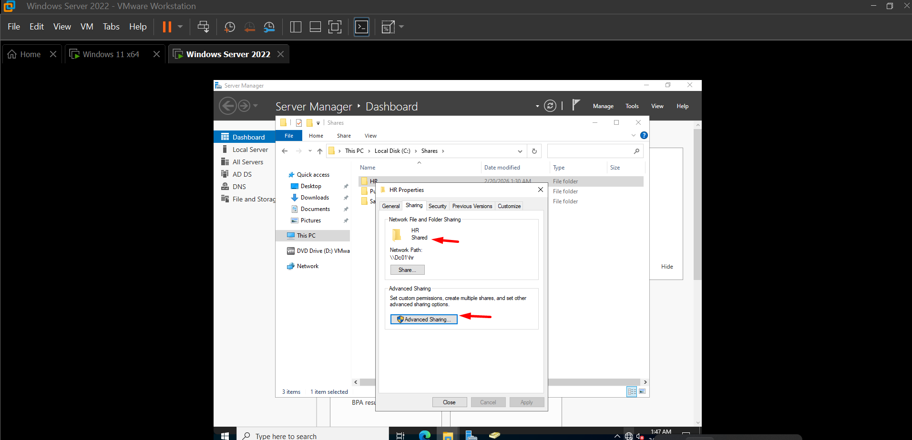
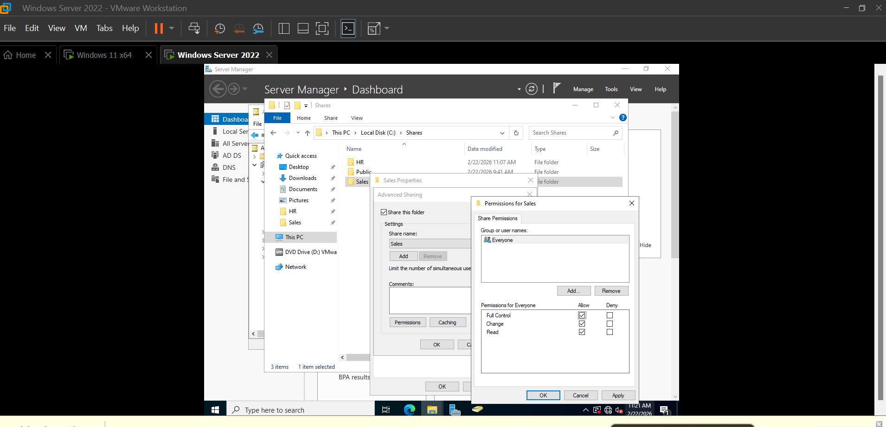
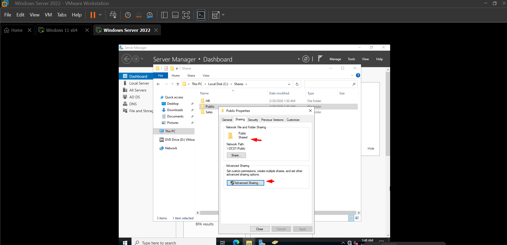

---

# Step 6 — Client Access Testing

Testing was performed from CLIENT01 using domain users.

HR User

- HR folder → Access granted
- Sales folder → Access denied

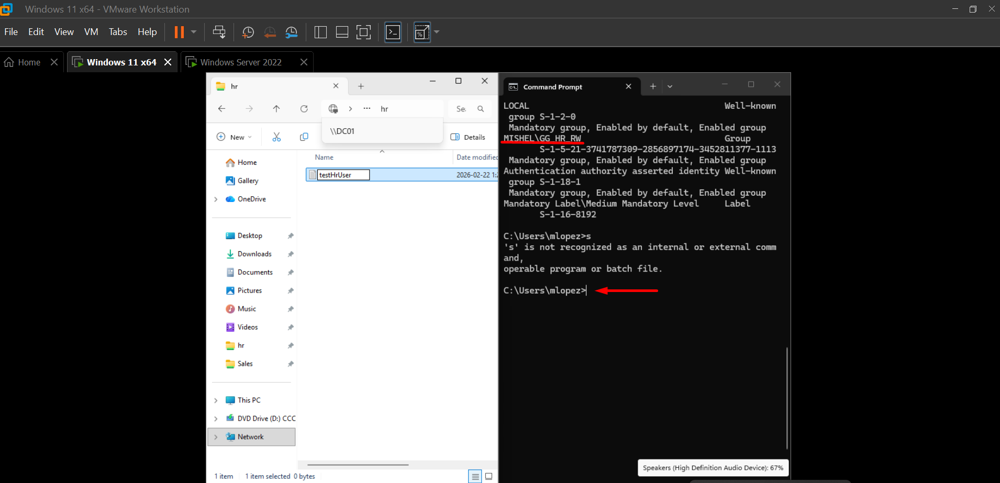
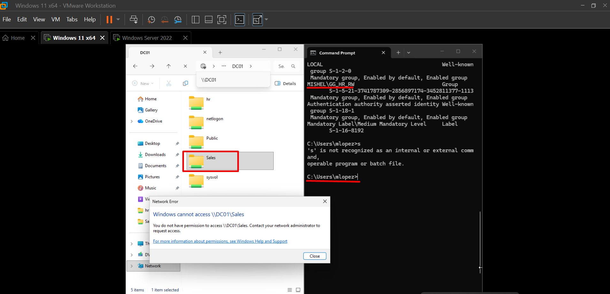

Sales User

- Sales folder → Access granted
- HR folder → Access denied

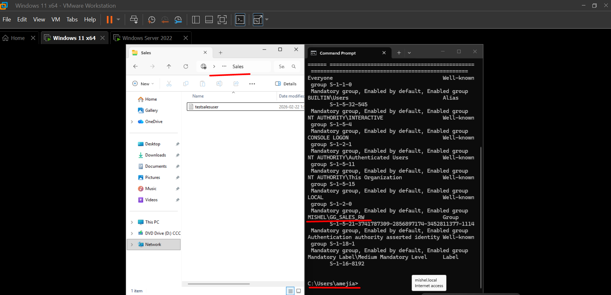
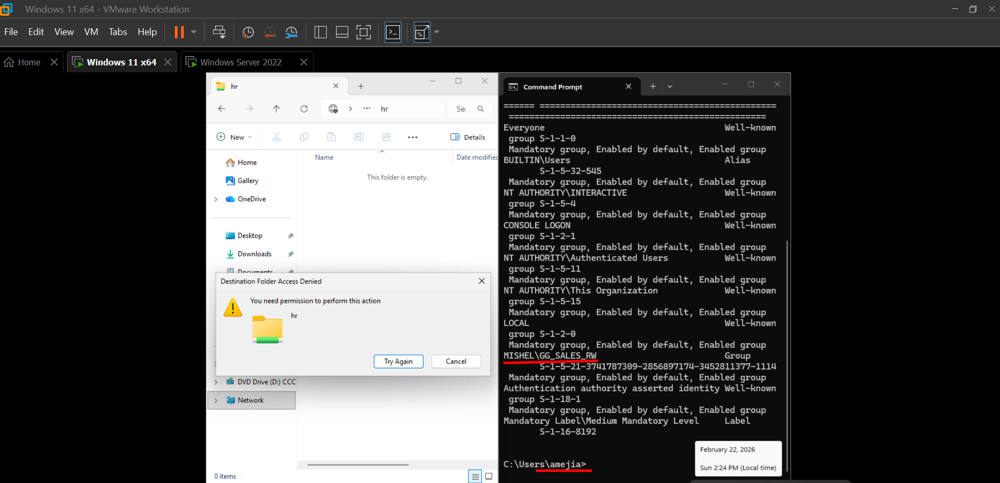

---

# Step 7 — Validation Commands

Commands used during testing:

whoami  
whoami /groups  

These commands helped verify user identity and group membership from the client machine.

---

# Troubleshooting — Share and NTFS Permissions

Issue:

An HR user could not modify files even though NTFS permissions were configured correctly.

Investigation:

- Verified group membership using whoami /groups
- Reviewed NTFS Advanced Security Settings
- Confirmed inheritance behavior

Root Cause:

Effective access depends on BOTH Share Permissions and NTFS Permissions. The most restrictive permission always applies.

Resolution:

Share permissions were updated to allow proper access while NTFS groups enforced security.

---

# What I Learned

This lab helped me understand how enterprise environments manage file access using structured group-based permissions instead of assigning rights directly to users.

Key learning points:

- NTFS permissions provide the real security control, while Share Permissions only allow network access.
- Inherited permissions can unintentionally grant access if not reviewed carefully.
- Effective access is determined by the most restrictive rule between Share and NTFS permissions.
- Using groups simplifies long-term management and reflects real IT Support practices.
- Troubleshooting requires verifying group membership, inheritance, and effective permissions together.

This experience improved my understanding of how file servers are managed and how permission issues are diagnosed in professional environments.

---

# Skills Demonstrated

- Active Directory Security Groups
- NTFS Permission Management
- SMB Share Configuration
- Role-Based Access Control
- Client Access Validation
- Troubleshooting Permission Inheritance

---

# Real-World Relevance

This lab replicates common IT Support responsibilities such as:

- Managing department access to file servers
- Supporting shared network resources
- Diagnosing permission conflicts
- Validating authentication and authorization
