# Active Directory Lab — Group Policy and Security Configuration

---

## Group Policy Design

In this lab, I created a domain-based Group Policy Object (GPO) to simulate a realistic workstation baseline configuration.  
The goal was to understand how centralized policies manage both user and computer settings instead of relying on local configurations.

The GPO was linked at the domain level to observe policy inheritance, scope, and how configurations flow across Organizational Units in a real-world Active Directory environment.

## Evidence

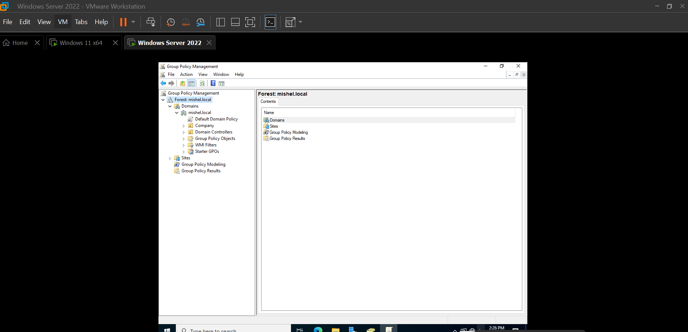
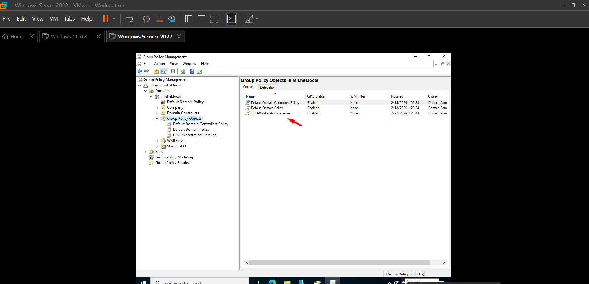
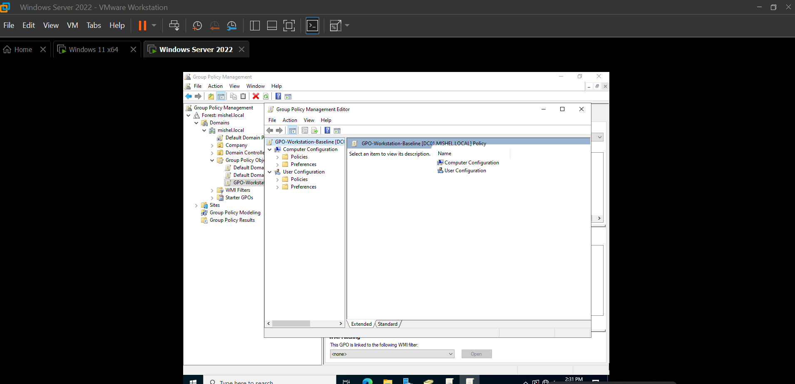

---

## User Policy Configuration

User configuration settings were applied to validate policy enforcement from the client perspective.  
I used visual desktop changes to confirm that policies were successfully applied after refreshing Group Policy.

## Evidence

---

## Computer Policy Configuration

Computer configuration policies were implemented to enforce workstation behavior regardless of the logged-in user.

Example configured:

Display Shutdown Event Tracker

This helped me understand how administrators control device-level behavior through centralized policies.

## Evidence

---

## GPO Linking and Scope

The GPO was linked at the domain level to analyze inheritance behavior and understand how policies apply across Organizational Units without needing manual configuration on each device.

## Evidence

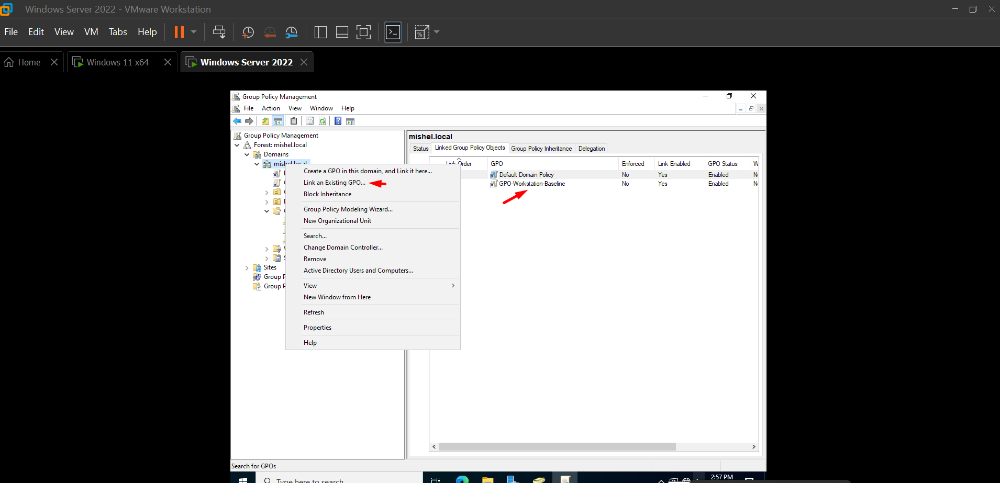

---

## Security Filtering

Security filtering was reviewed to understand how policies can be applied only to specific users or computers.

Authenticated Users remained enabled during testing so I could observe default policy behavior before narrowing the scope.

## Evidence

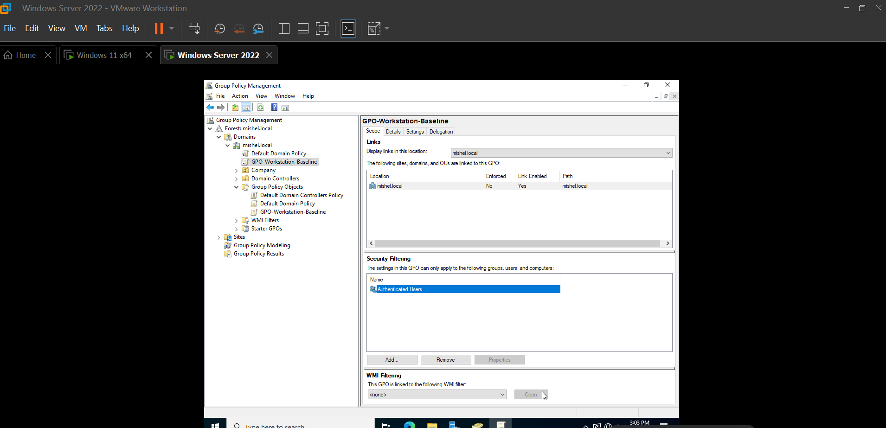

---

## Policy Update from Client

Policies were refreshed manually using:

`gpupdate /force`

This command forces an immediate refresh and is commonly used during testing or troubleshooting scenarios.  
In enterprise environments, policies update automatically in the background.

## Evidence

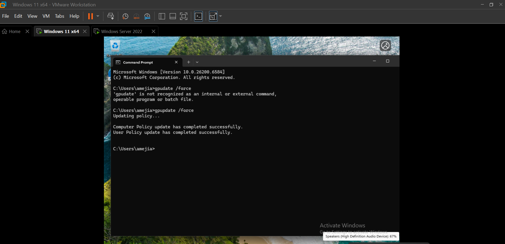

---

## Policy Verification

Policy application was validated using:

`gpresult /r`

This allowed me to confirm which policies were applied and troubleshoot configuration results from the client side.

## Evidence

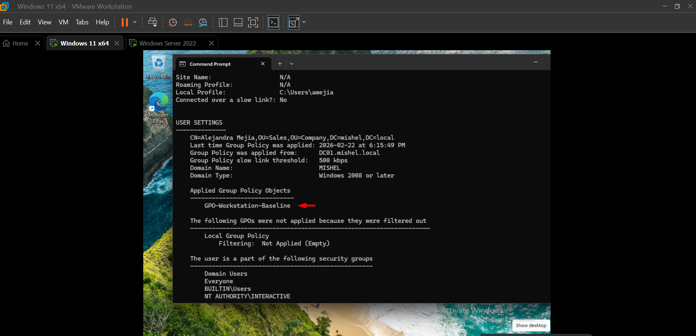

---

## Desktop Policy Validation

After refreshing policies, desktop behavior changed as expected, confirming successful GPO application.

Seeing the changes directly on the client machine helped reinforce how Group Policy impacts the end-user environment.

## Evidence

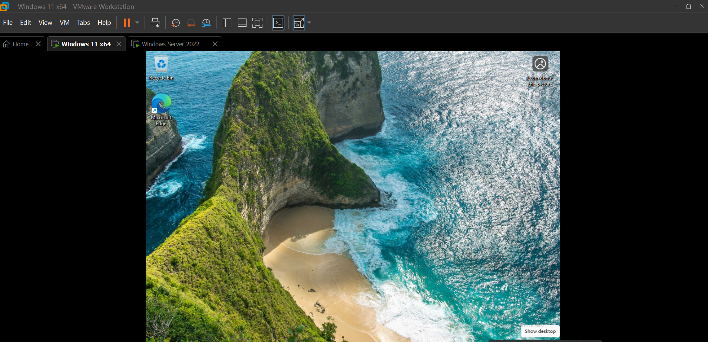
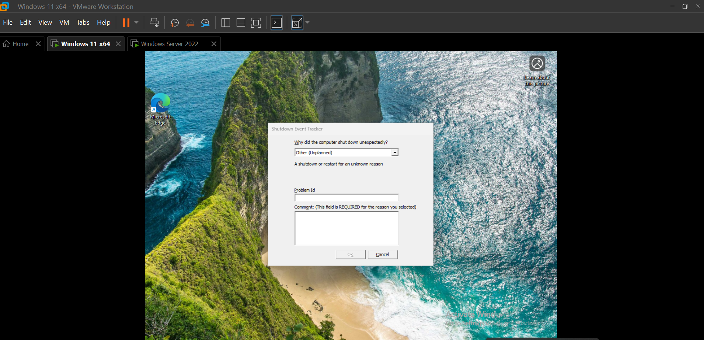

---

## Domain Password Policy

The Default Domain Policy was configured to enforce centralized password requirements for all domain users.

Location:

Default Domain Policy  
Computer Configuration  
Policies  
Windows Settings  
Security Settings  
Account Policies  
Password Policy  

This exercise helped me understand how organizations enforce consistent security standards across identities.

## Evidence

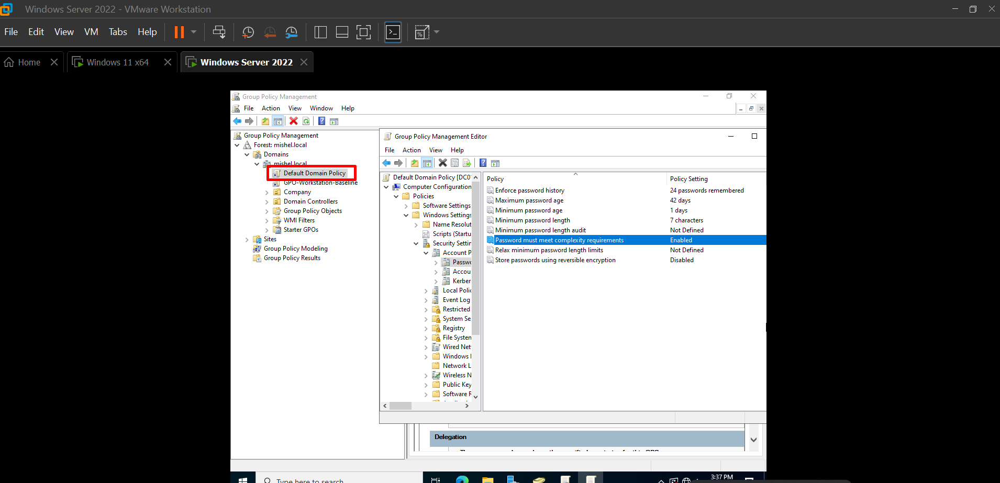

---

## Organizational Unit Structure

A Workstations OU was created to manage workstation-specific policies separately from users, simulating a structured enterprise environment.

## Evidence

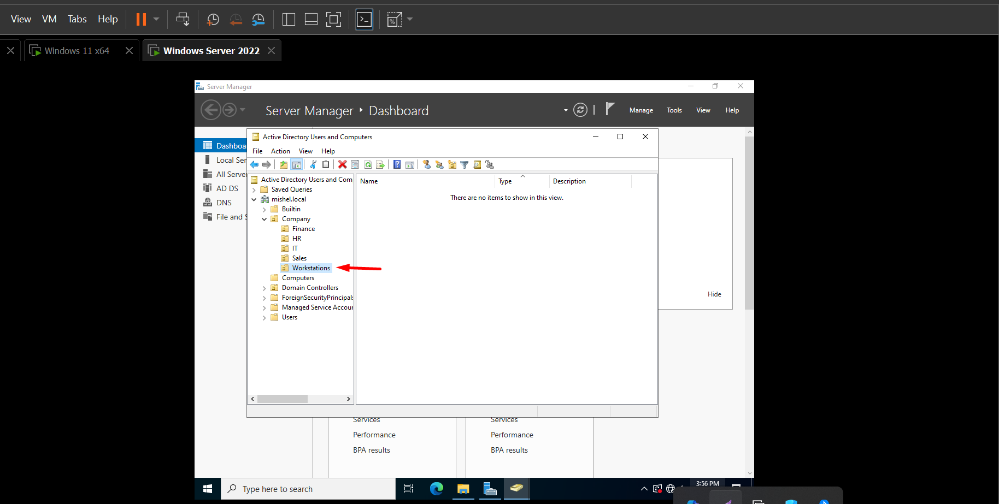

---

## OU GPO Configuration

A dedicated GPO was configured and linked directly to the Workstations OU to demonstrate targeted policy deployment.

## Evidence

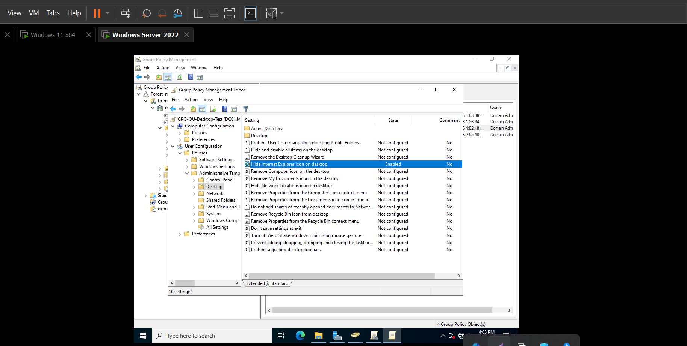
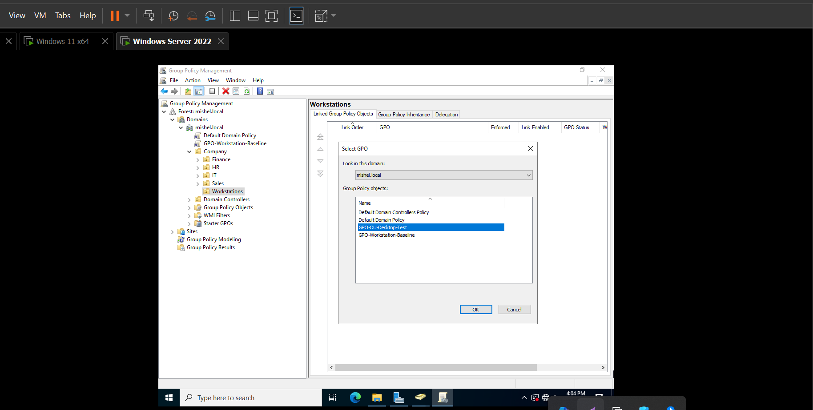

---

## Group Policy Inheritance

Inheritance testing was performed to understand how parent policies apply to Organizational Units and how precedence affects configuration outcomes.

Before blocking inheritance:

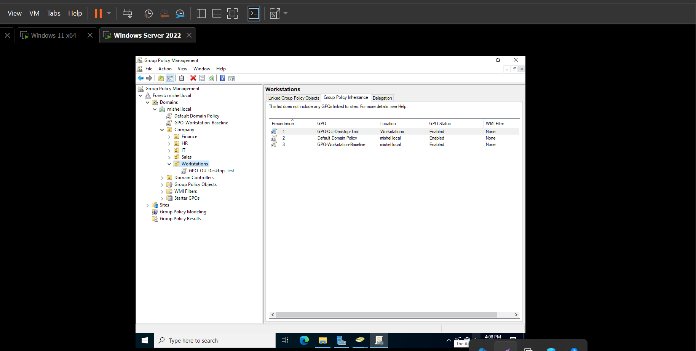

After blocking inheritance:

Blocking inheritance prevents parent policies from applying unless they are explicitly enforced.

---

## Workstations Block Inheritance

Additional testing was performed by blocking inheritance at the OU level to observe how policies behave when parent configurations are restricted.

## Evidence

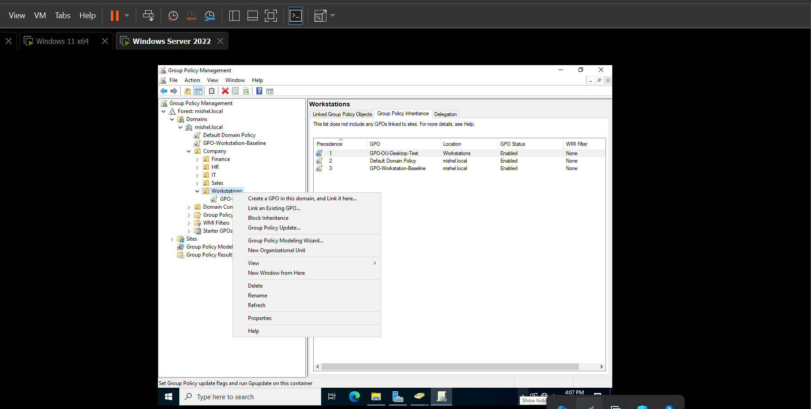

---

## Fine-Grained Password Policy

A security group was created to apply a different password policy to selected users.

Fine-Grained Password Policies allow organizations to enforce different password requirements without modifying the Default Domain Policy.

This lab helped me understand how precedence determines which password policy applies when multiple FGPP exist.

## Evidence

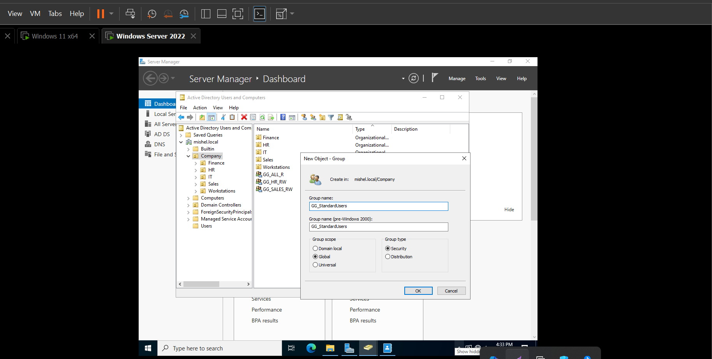
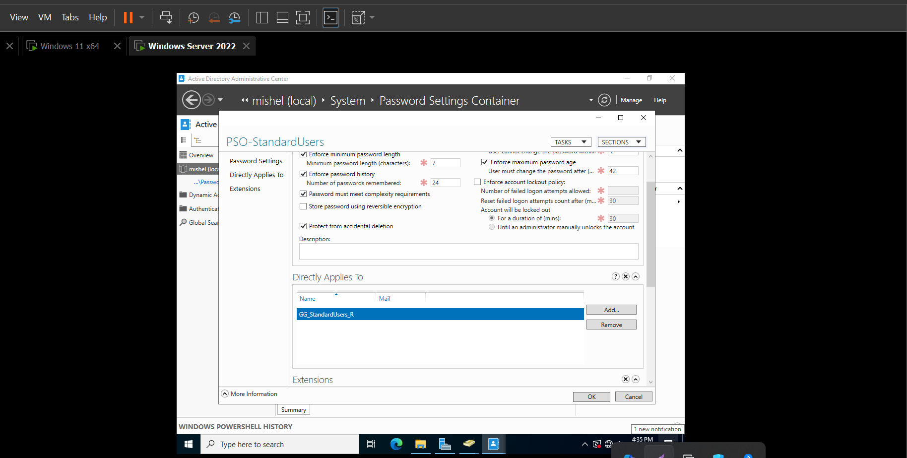
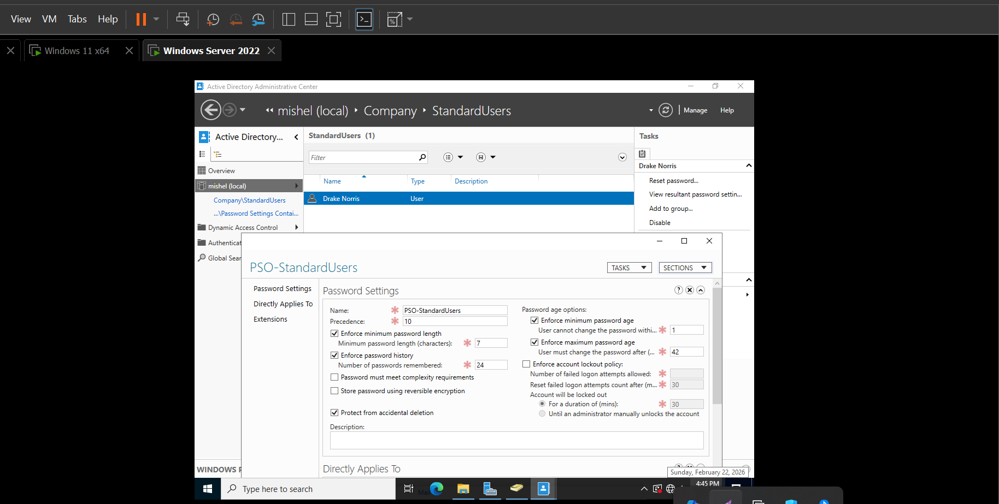

---

## What I Learned

This lab gave me a deeper understanding of how Group Policy works in real enterprise environments and how IT Support professionals manage workstation configurations and identity security.

Key concepts reinforced:

- Difference between User Configuration and Computer Configuration
- How GPO linking affects Organizational Units
- How inheritance and precedence control policy behavior
- How Security Filtering limits policy scope
- Why `gpupdate` and `gpresult` are essential troubleshooting tools
- Difference between Domain Password Policy and Fine-Grained Password Policy
- FGPP applies to users or groups instead of Organizational Units
- How precedence determines which password policy is enforced

This experience strengthened my hands-on understanding of centralized policy management, workstation security, and real-world Active Directory troubleshooting.
