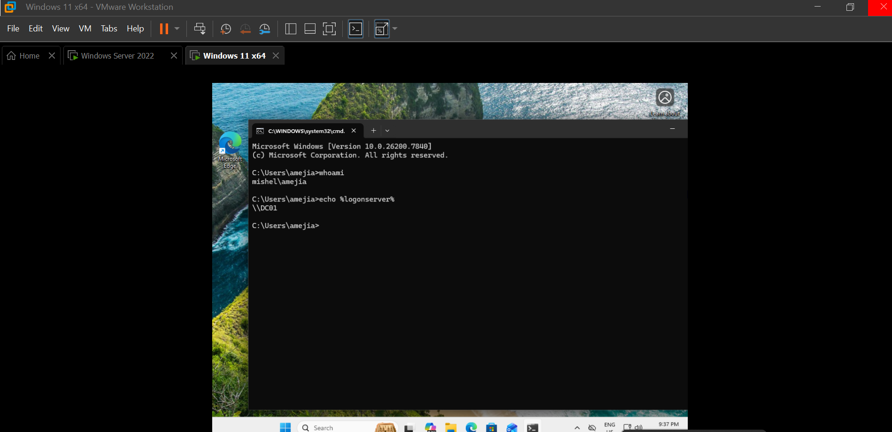
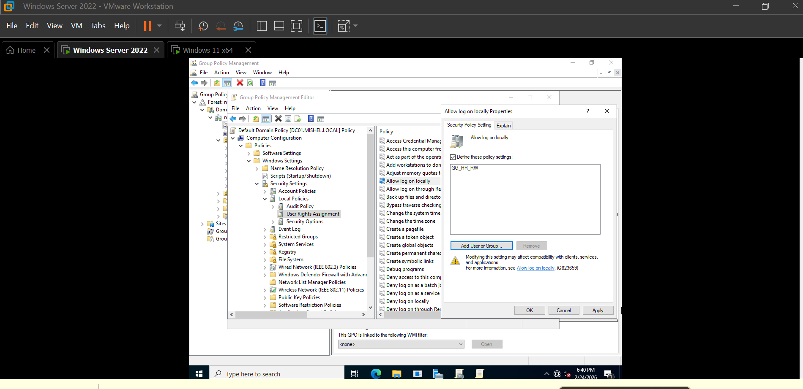
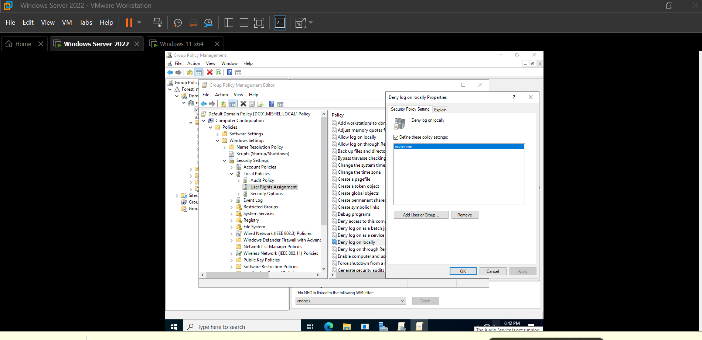
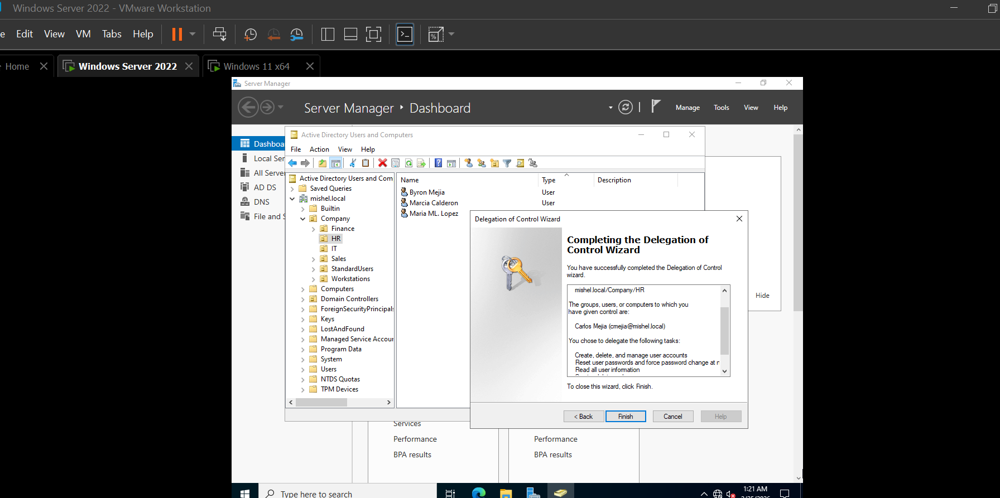
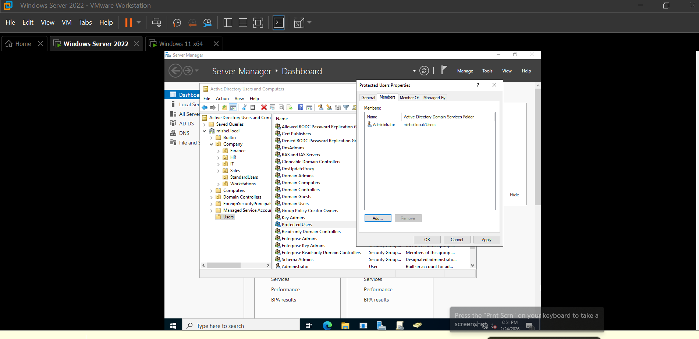
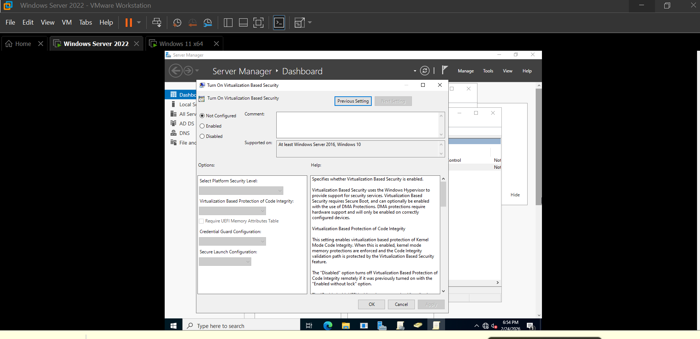
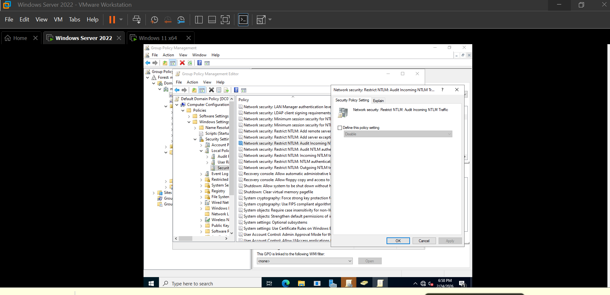
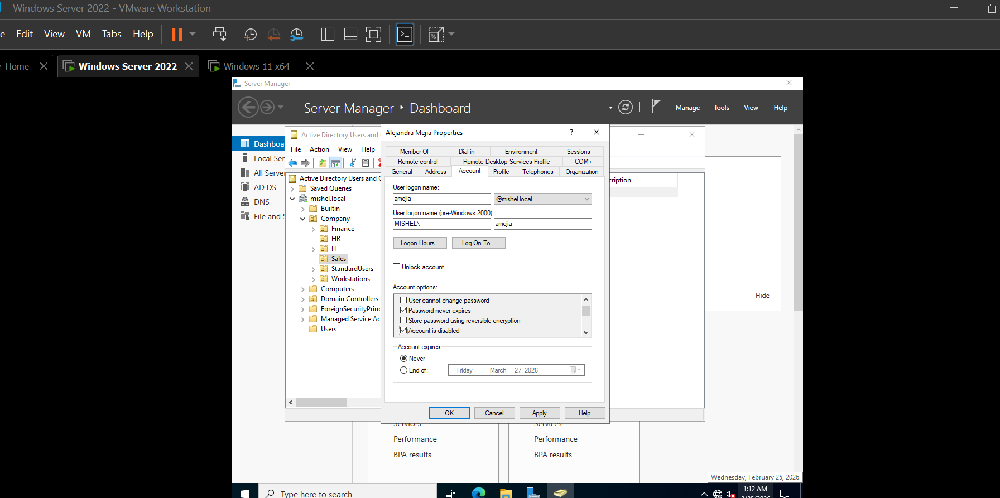
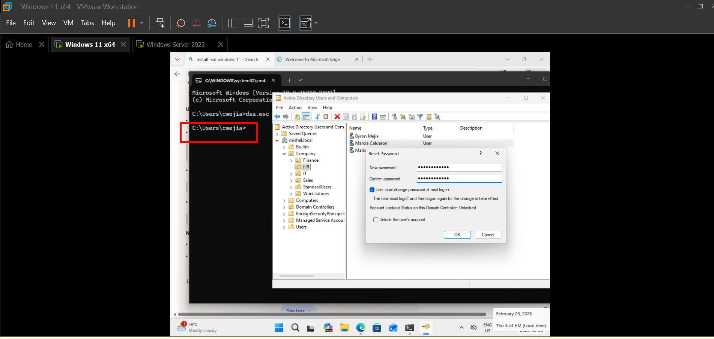

# Active Directory Security & Delegation Lab

This lab demonstrates how security delegation, user rights management, and Active Directory protection mechanisms work in a real enterprise-like environment.

The objective was to simulate how IT Support teams manage security without using Domain Admin privileges, following least privilege principles.

---

## Lab Environment

- Windows Server 2022 (DC01)
- Windows 11 Client (CLIENT01)
- Domain: mishel.local
- Tools Used:
  - Active Directory Users and Computers
  - Group Policy Management
  - RSAT Tools
  - Local Security Policy

---

## Step 1 — Client Domain Verification

The client machine was successfully joined to the domain and verified inside Active Directory.

---

## Step 2 — Configure User Account Rights

User account rights were reviewed and configured to simulate controlled access environments.

Policy areas reviewed:

- Local Security Policy
- User Rights Assignment

---

## Step 3 — Restrict User Account Rights

Security restrictions were validated to ensure users only receive required permissions.

The objective was to follow least privilege practices commonly used in enterprise environments.

---

## Step 4 — Delegate Control in Active Directory

Delegation of Control was configured on the HR Organizational Unit.

A non-admin IT user was granted permission to manage HR users without Domain Admin access.

Tasks delegated:

- Reset passwords
- Modify user attributes

---

## Step 5 — Protected Users Group

A test administrative account was added to the **Protected Users** security group.

Purpose:

- Enforce stronger authentication protections
- Prevent legacy authentication usage

---

## Step 6 — Credential Guard Policy Review

Device Guard and Virtualization-Based Security policies were reviewed.

This step demonstrates awareness of modern credential protection technologies used in enterprise environments.

---

## Step 7 — NTLM Policy Review

The NTLM authentication restriction policy was reviewed inside Group Policy.

No production changes were made; this step focused on understanding enterprise authentication hardening.

---

## Step 8 — Identify Problematic Accounts

Security analysis was performed by reviewing account settings such as:

- Password never expires
- Disabled accounts
- Locked accounts

---

## Step 9 — Delegated Administration Test from CLIENT01

RSAT tools were installed on CLIENT01.

A delegated IT user successfully performed password reset actions remotely without using Domain Admin privileges.

This simulates real-world IT Help Desk operations.

---

## Security Delegation Review

Additional review of delegation configuration and OU security structure.

---

## What I Learned

- How delegation of control works in Active Directory
- Difference between Domain Admin and delegated permissions
- Managing users remotely using RSAT tools
- Reviewing NTLM and Credential Guard security settings
- Identifying risky account configurations
- Applying least privilege access in enterprise environments

---

## Key Skills Demonstrated

- Active Directory Administration
- Security Delegation
- Identity Protection Concepts
- Group Policy Review
- Enterprise Authentication Awareness
- IT Support Security Operations

---
